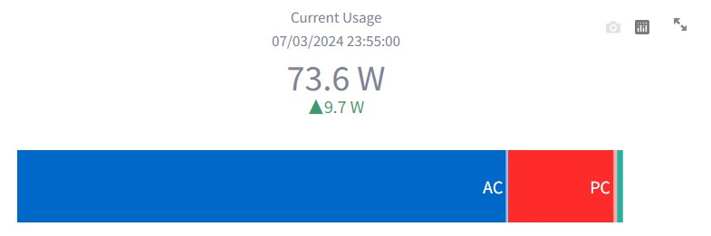
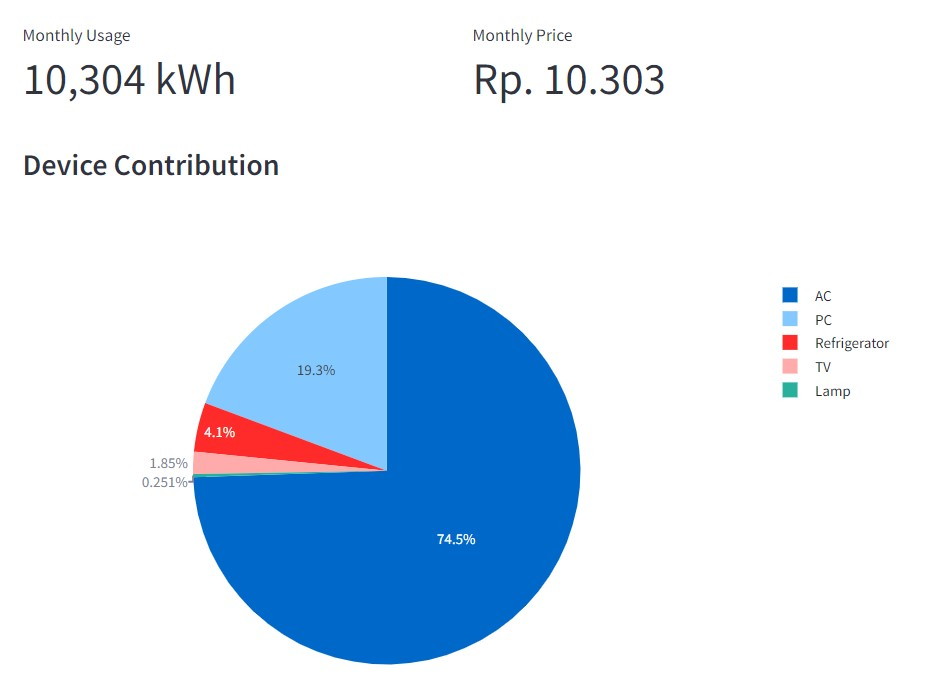
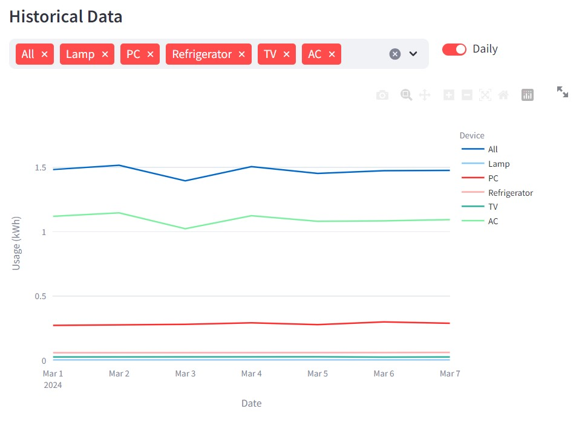
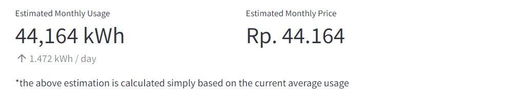
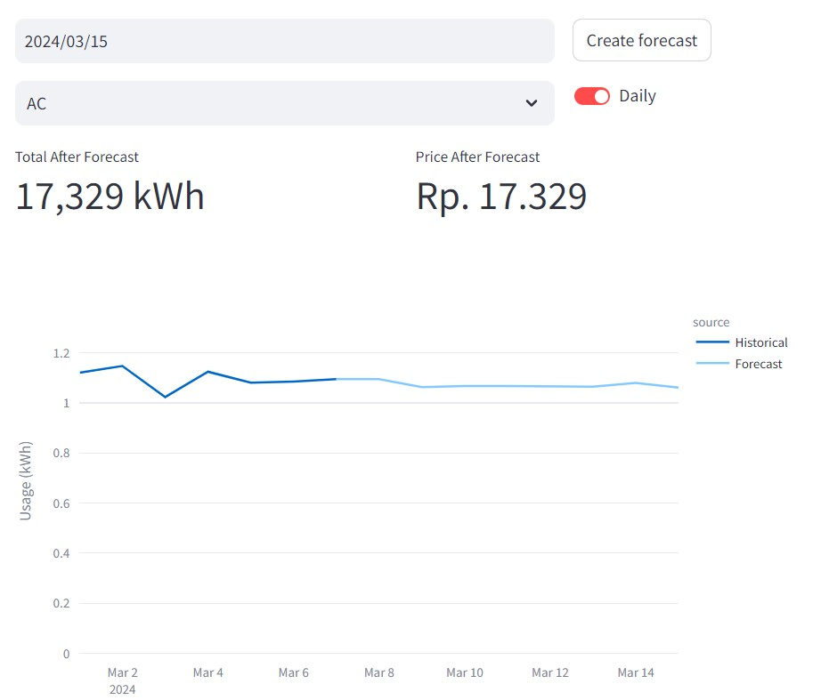

# Eelectricity Usage Monitoring and Forecasting (Experimental)

This reposity contains an example application development for monitoring and forecasting of electric usage. Note that everything in this repositort is for experiment and study purpose.

This repository contains several things:

- Exploratory data analysis (EDA) of a dummy electricity usage dataset and the forecasting model development.
- Monitoring and forecasting dashboard using [Streamlit](https://streamlit.io/).
- A sample edge application for ESP32 device.

For details about the EDA and model training of this particular case, please check the respective notebook, `eda_and_training.ipynb`. The notebook also explains about why the specific approach is used and what experiments that I have done.

In `edge/edge_app.ino`, I also provide a sample script to be implemented in ESP32-like device. However, the code is not tested and only to show the code flow.

This documentation is focused on the Streamlit dashboard. Note that the streamlit dashboard can be seen in community cloud: https://mukhlas-electricity-forecast-experiment.streamlit.app/. Please refer [the respective site](https://streamlit.io/cloud) for details about how to deploy Streamlit into the community cloud.

## Setup & Run

To run the Streamlit application, you need to run the following to install the required packages in your environment

```bash
pip install -r requirements.txt
```

Then simply run the following command to launch the dasboard

```bash
streamlit run app.py
```

## Data

In order for the dashboard to work, obviously it needs to access some data. For this experiment purpose, the data is strored in `dataset` folder in CSV format. The application will specifically load dataset with path `dataset/appliance_data.csv` by default. Note that dataset only contains time series data for 7 days of March 2024. Optionally, you can specify custom CSV data by specifying it in `--data` argument when running the Streamlit.

## Forecasting Model

The forecasting model is [LightGBM](https://lightgbm.readthedocs.io/en/stable/). By default, the application will load the model `.pkl` in `model/lgbm_forecaster.pkl`. Optionally, you can specify custom model file by specifying it in `--model` argument when running the Streamlit.

The training of the model is covered in the EDA notebook, please check it to get more details. The LGBM model is actually operated using [`Darts` package](https://unit8co.github.io/darts/).

## What is Shown

The following information is shown in the dashboard

- Latest power consumption and the contribution from each device, to represent the current power used by each device.



- Total energy consumed and the estimated price until the current date to show how much we have used the electricity so far and the device that caused it the most.



- The historical power usage (per 5 minutes) and the energy usage (daily) to show the trends of electricity consumption in the past



- Estimation of the energy consumption and the price until the end of the month, which is calculated simply by multiplying the average kWh per day with the number of days



- Power and energy consumption forecasted by LGBM model until a specific date.



## Code Structure

Here are some brief explanations about how the code is structured. Note that the code structure is inspired by the MVC architecture. 

- `app.py`: the main python entry point
- `src`: package that contains all modules for `app.py`
  - `controller`: modules that contain logics that connects the data handler and forecaster (`data` modules) with the UI (`view` modules). These are the only module that is used directly by `app.py`. These 
  - `data`: modules that handle and contain the data and forecasting model.
  - `views`: modules that purely handle the UI
  - `arg_parser.py`: module that handle input argument of `app.py`.
  - `constants.py`: module that define constants used by all other modules.